# Analysis — reports, statistics, and tools

The Analysis area is where you turn coded data into findings. It offers eleven
analytical reports, three tools (codebook, references, SQL), the R console,
and the smart **Publish** button that exports any report as a Word, Excel or
PowerPoint document.

The left bar (Reports list) and the center view are driven by a single
registry, so the two can never drift apart. The header always shows a
**Publish** button (see below) and the current report's own action buttons.

## How to reach it

- Ribbon → **Reports**. While active, the left bar becomes the reports list:
  the **Analytical reports**, a **Tools** section, and **Graphs**.

## The reports

### Code frequencies — how often is each code used?

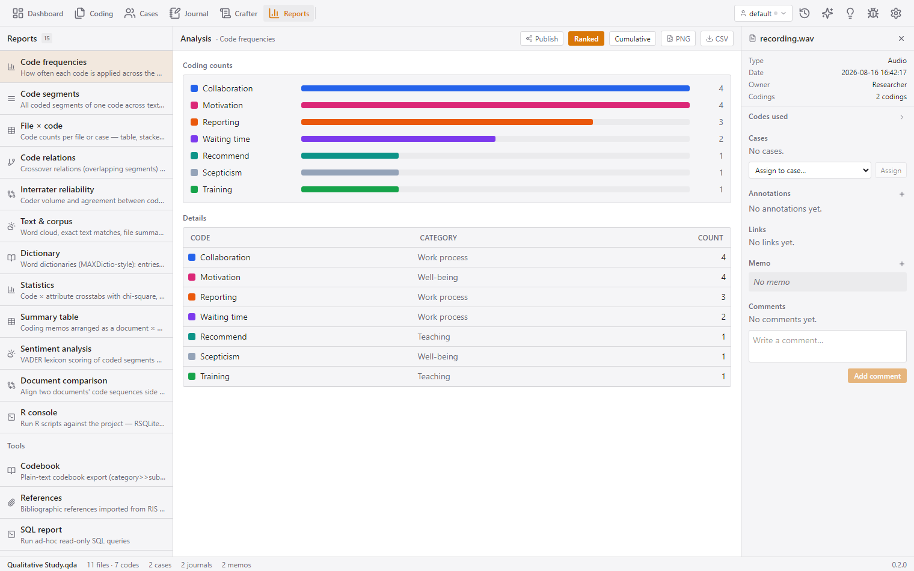

A ranked bar list + a details table (code, category, count). Click a row for
the **code summary card**: total codings split by text/image/AV, files used,
and the code memo. **Cumulative** mode shows the cumulative-codings chart
(downloadable as PNG) + table. CSV export.

*Typical use:* the first sanity check — which themes dominate, and is the
coding spread as expected?

### Code segments — every coded passage

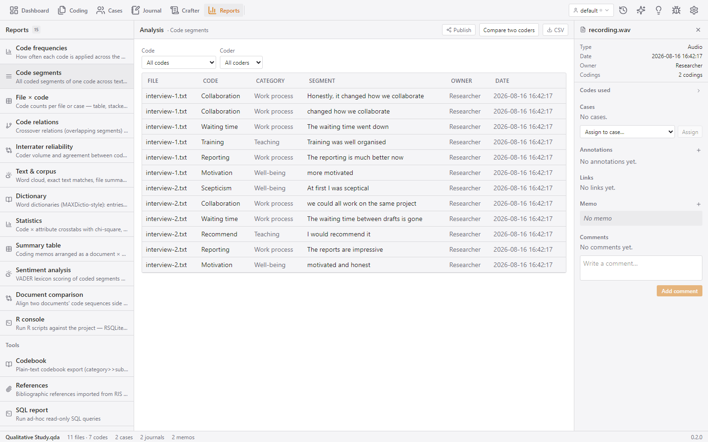

All segments flat: file, code, category, segment text, coder, date — filterable
by code and coder. Choosing a **single code** switches to the rich view (kind
Text/Image/AV with positions/geometry and memo). **Compare two coders** mode
shows a per-file coder-A-vs-coder-B segment table. CSV export.

*Typical use:* reading every quote for one code, or auditing what each coder
produced.

### File × code — coding across sources

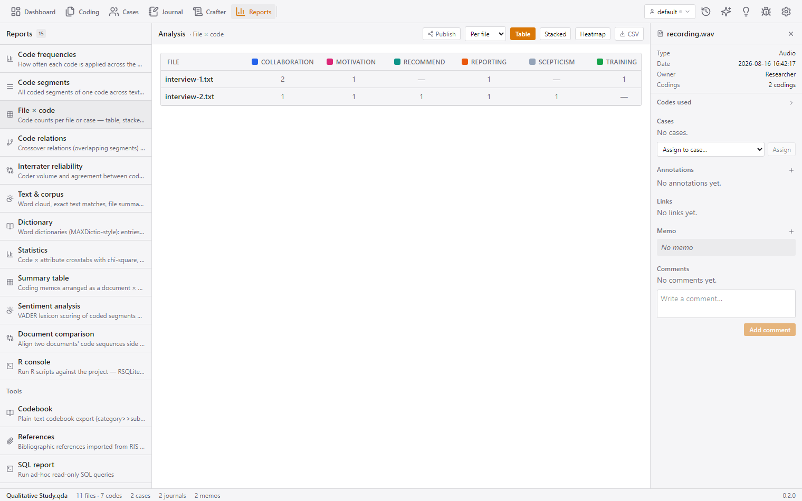

A dimension picker (**per file** / **per case**) and three views: a comparison
**table**, a stacked "codings by source" **chart**, and a coding **heatmap**
(canvas). CSV export.

*Typical use:* seeing at a glance which documents carry which themes, or which
cases are thin on a theme.

### Code relations — co-occurrence and crossovers

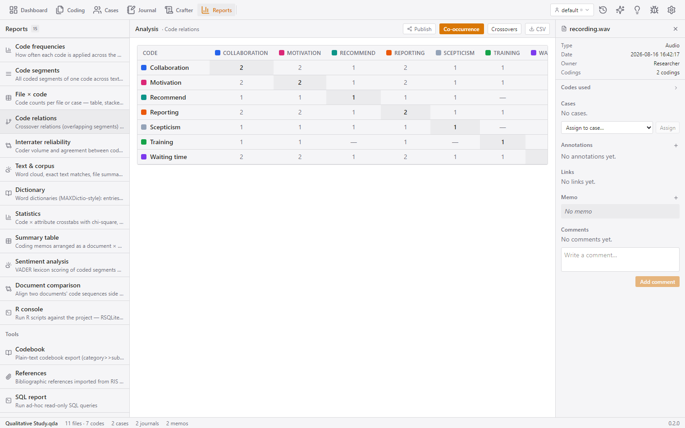

A **co-occurrence matrix** (code × code, "N files" tooltips, diagonal marked)
and **Crossovers** mode: for a selected coder, which codes overlap in the same
file (code_a → code_b counts). CSV export.

*Typical use:* discovering which themes travel together — the seed of a
network or a typology.

### Interrater reliability — do coders agree?

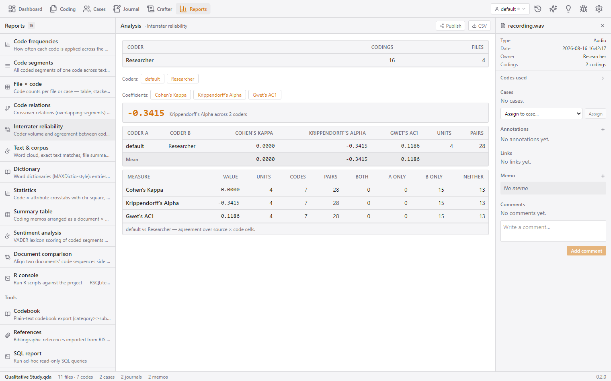

A **coder volume table** (coder, codings, files) plus a multi-coder agreement
computation:

- Select **2+ coders** as toggle chips; QCnext computes **Krippendorff's
  alpha** over all selected coders **and** a pairwise table (Cohen's kappa,
  Krippendorff, **Gwet's AC1**, units, pairs, mean row).
- With exactly **two** coders, a full agreement card: both / only-A / only-B /
  neither counts per measure.
- Coefficient chips toggle columns on/off. CSV export.

*Typical use:* proving inter-coder agreement for a methods section.

### Text & corpus — word cloud, matches, summaries

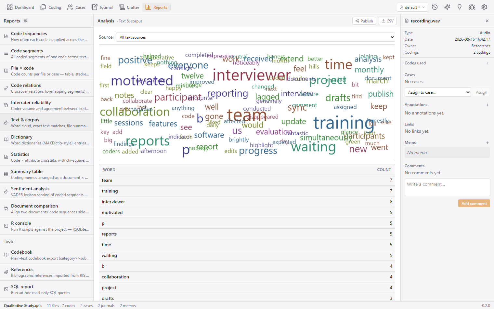

Four tabs:
- **Word cloud** — source picker, canvas word cloud, frequency table.
- **Exact matches** — identical coded segments across files.
- **File summary** — per file: name, type, codes, segments, cases, words.
- **Attributes** — attribute values with value-label resolution, scope, entity.

CSV exports.

*Typical use:* orientation, triangulation, and descriptive summaries.

### Dictionary — MAXDictio-style word dictionaries

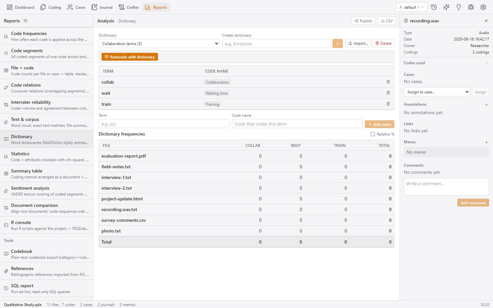

Create/delete dictionaries; import from `.txt`/`.csv`; add entries as
**term → code name** (datalist of existing codes); run **dictionary autocode**
(reports total + per-code counts + unmatched code names); and a
**document × term frequency matrix** with a normalize toggle. Also usable from
the AutocodeDialog. CSV export.

*Typical use:* fast systematic coding of large corpora ("all mentions of
'wait' → Waiting time").

### Statistics — code × attribute statistics (mixed methods)

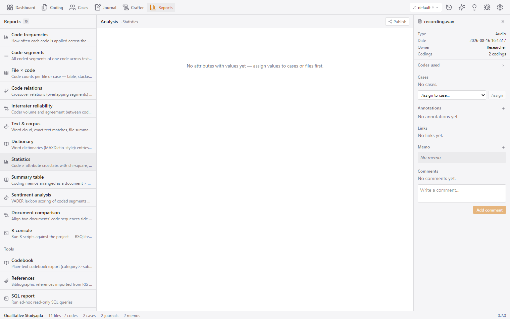

Pick an attribute + codes; three analyses:
- **Crosstab** — chi-square (with/without Yates), df, p, Cramér's V, with a
  row/column-totals table.
- **Group comparison** — Mann-Whitney U + descriptives for the code
  present/absent groups on a numeric variable.
- **Code by variable** — mixed-methods stacked bars + table per variable value.

CSV exports.

*Typical use:* "Do participants who mention 'motivation' differ from those who
don't on a questionnaire scale?"

### Summary table — coding memos as a document × code grid

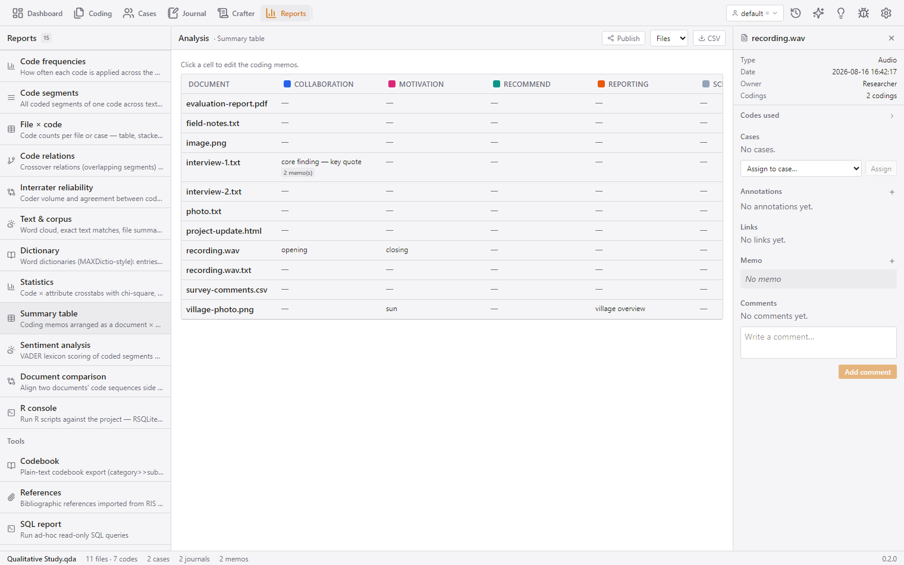

A document/case × code grid whose cells hold the **coding memos**. Click a
cell to **edit each coding's memo inline** (saved immediately); cells with
multiple memos show a count badge. Scope file/case. CSV export.

*Typical use:* reviewing your analytical comments per code and document in one
place.

### Sentiment — lexicon or AI scoring

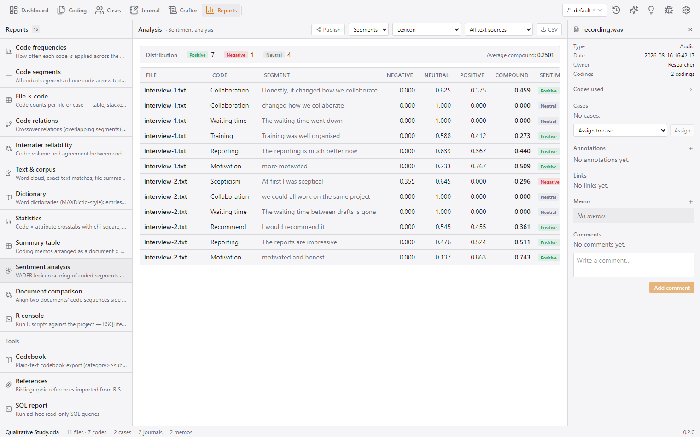

Sentiment of coded segments or whole text sources:
- **Lexicon mode** — offline VADER scoring (neg/neu/pos/compound per row).
- **AI mode** — labels + reasons via the chat provider (needs AI configured;
  forces segments scope).

Scope picker, source picker, distribution summary chips + average compound.
CSV export.

*Typical use:* triaging emotional tone across interviews.

### Document comparison — two documents side by side

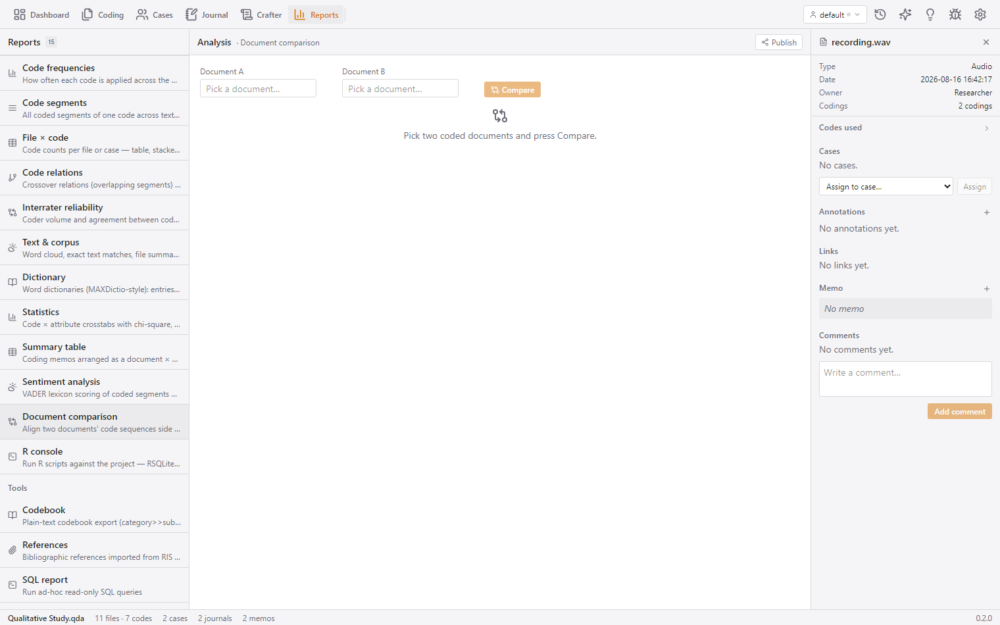

Pick two text files: a two-column chart of **code-colored blocks aligned by
LCS** with connector lines, plus statistics (Dice code-set similarity,
sequence ratio, aligned count, segments per file), a per-code co-occurrence
table, and click-a-block-to-jump to the segment in the coder. CSV of the
per-position alignment table.

*Typical use:* MAXQDA-style comparison of two interviews or two versions of a
document.

## Tools

### Codebook

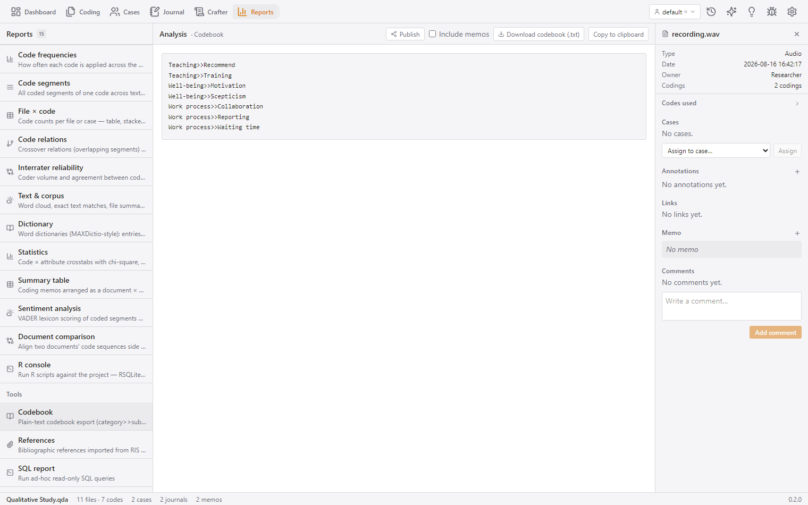

A plain-text codebook with a **"with memos"** toggle; **Download**
(codebook.txt) and **Copy to clipboard**; rendered as selectable text. The
format round-trips with the codebook importer.

### References

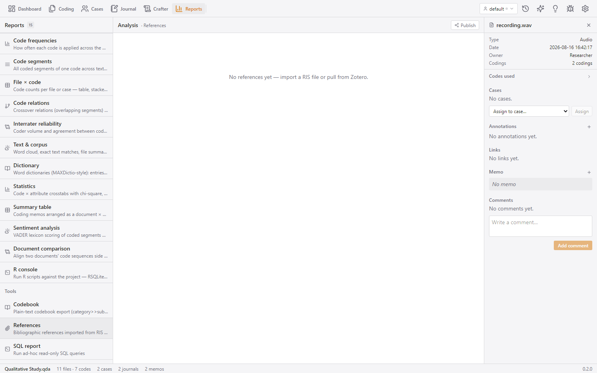

A bibliography table (title, authors, year, type, linked sources) imported via
RIS/Zotero (see [interchange.md](interchange.md)). Open a linked source in the
coder, detach it, attach a PDF/EPUB file to a reference, or delete a reference
(confirm). CSV export.

### SQL — query your own data

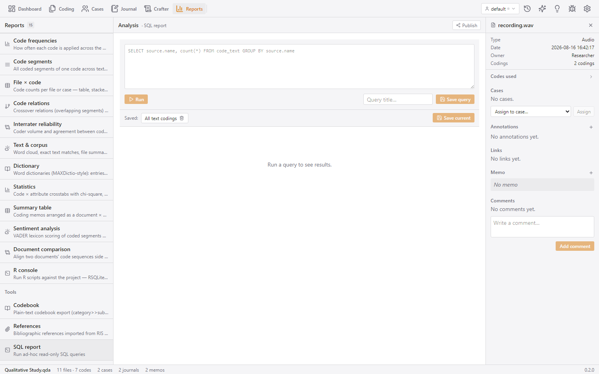

Run **read-only** SQL against the project database; results as a table; save
queries by title, load and delete saved queries. Non-`SELECT` statements are
rejected (results capped for safety). This is a power-user window into the
project data for researchers who know SQL.

### R console

Run **R scripts** against the project when R is installed (see
[status-and-tasks.md](status-and-tasks.md) for how background jobs work): a
script editor with templates (code × document matrix via RSQLite, HTTP via the
app's own API, interrater via the `irr` package, word frequencies via
`quanteda`), **Run** as a background job in the task queue, saved scripts, and
an **outputs/artifacts** area (stdout/stderr, exit code, produced PNGs
rendered and CSVs previewed). A status badge reports whether R is installed.
"Prepare report data" exports a report's data as CSV and appends a stub
script.

## Publishing a report

The header's **Publish** button exports the current report:
- **Formats**: Word (.docx), Excel (.xlsx), PowerPoint (.pptx — only for the
  per-code reports that render as slide decks).
- A file-name field (defaults to `<report>-<date>`); QCnext renders the
  document on the backend and downloads it.
- Reports without a publisher show a "Publish not supported" note.

Reports that support publishing: code frequencies, code segments, summary
table, codebook.

## High-level logic

All reports read the **same coding data** (text/image/AV codings + coder
ownership + case/attribute links) through dedicated report endpoints. Chart
PNGs and the publisher are rendered server-side; tables are rendered in the
browser and exported as CSV locally. Interrater and statistics use the
project's own statistical routines (Krippendorff's alpha, Cohen's kappa, Gwet
AC1, chi-square, Mann-Whitney U), so you don't need R for the built-in
reports — R is an *optional* extension for analyses QCnext doesn't ship.
