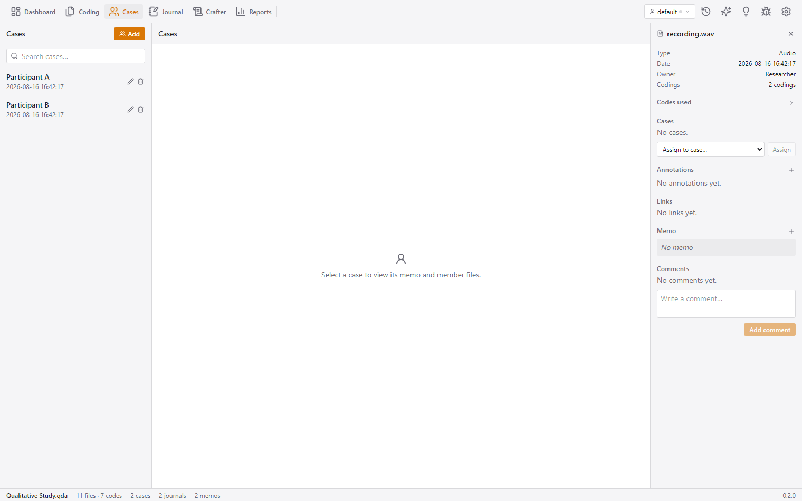

# Cases and Attributes — study entities and structured variables

**Cases** represent study entities — participants, schools, organisations,
episodes — that you want to analyse as units. Files are linked to cases, and
cases carry **attributes**: structured variables (role, age group, group,
year, …) that enable mixed-methods analysis (see the Statistics report in
[analyze.md](analyze.md)).

## How to reach it

- Ribbon → **Cases**.

## The layout on this screen

- **Left bar**: the case list (search box + rows showing name and date).
- **Center**: the selected case's details.
- **Right bar**: the Inspector.

## Features

### Case list

- **Search** matches case name and memo.
- **Add case** (header button) creates an untitled case, selects it and opens
  its name editor immediately.
- **Inline rename** (pencil icon or context menu; Tab moves the editor to the
  next row).
- **Row context menu**: Details / Rename / Delete (confirm).

### Case details (center)

- **Header**: case name + "created by" meta (date · owner).
- **Memo**: textarea + Save (disabled until dirty).
- **Properties**: the attribute editor — see below.
- **Member files**: the files linked to this case, with an unlink button per
  row.
- **Link files**: a dropdown of not-yet-linked sources + Link button (a hint
  appears once everything is linked).

### The attribute editor

- Lists every attribute type that applies to cases, each with its current
  value for this case.
- **Add type**: an inline editor for a new attribute type name, plus an
  optional **value-labels** list — raw stored value → display label
  (e.g. `1 → "Strongly agree"`). Types with value labels render as labelled
  dropdowns instead of free text.
- Values save on blur / Enter (per-field spinner); a **Custom value…** option
  allows free text even for labelled attributes.

### Cross-linking from the file manager

Files can also be linked to cases from the file manager's row context menu
(**Assign to case…**).

## High-level logic

Cases and files are linked as **memberships**, and cases can additionally hold
**spans** (a passage of a file bound to a case). Attributes are stored as
name → value rows on an entity (case or file), with the attribute type
definitions (scope, value type, value labels) held separately — so you can add
a "Role" type once and label its values consistently across every case. The
case/file × attribute structure is what powers the **Statistics** and
**Attributes** reports.
