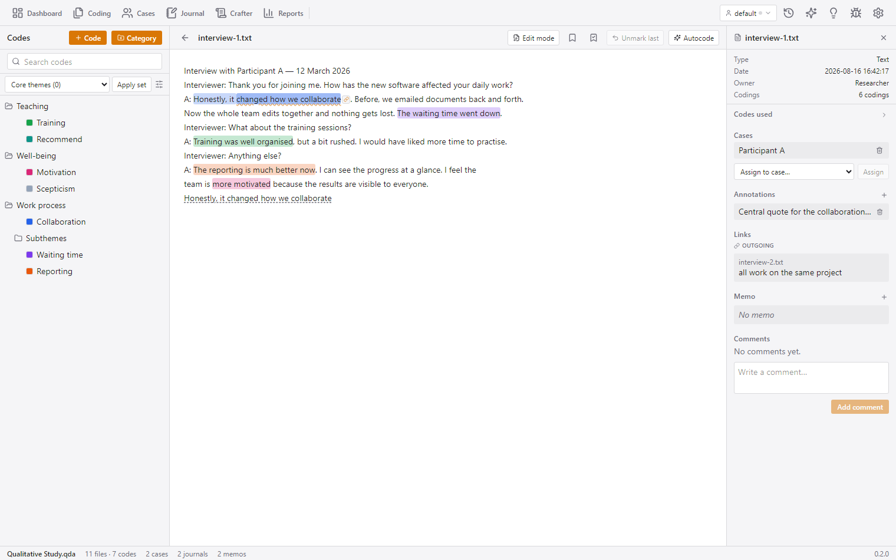
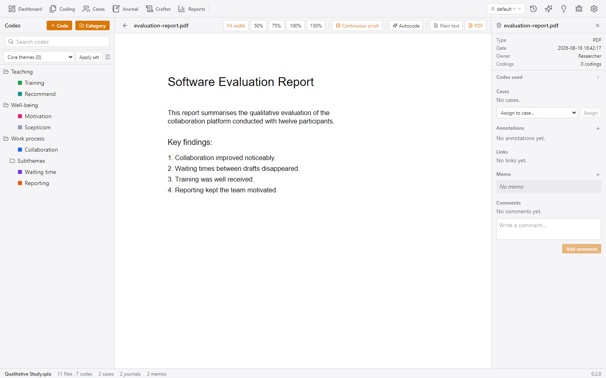
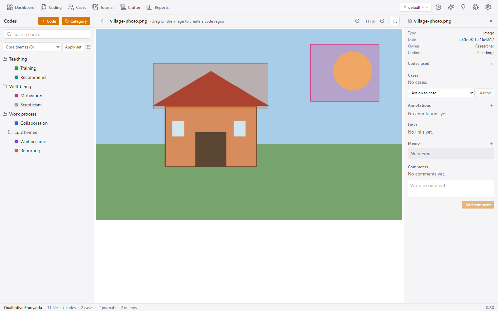
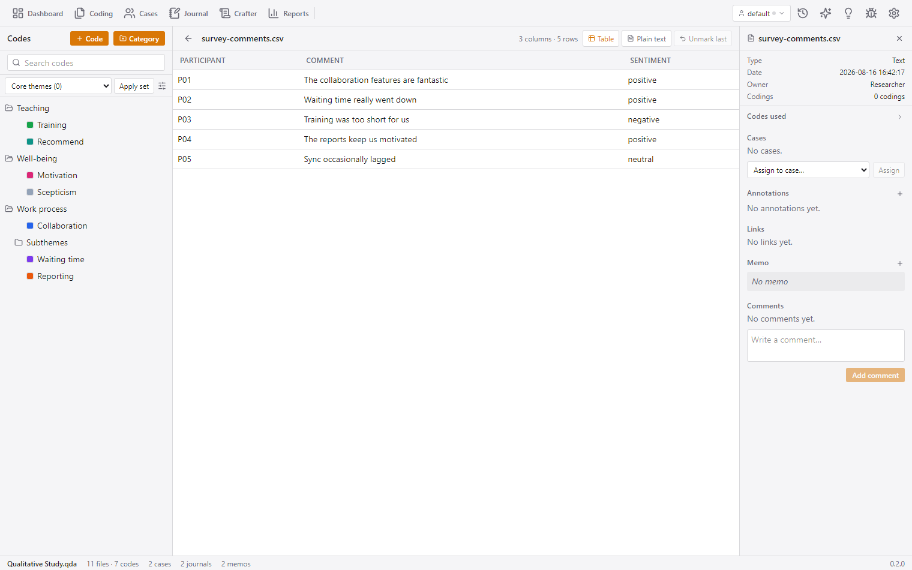
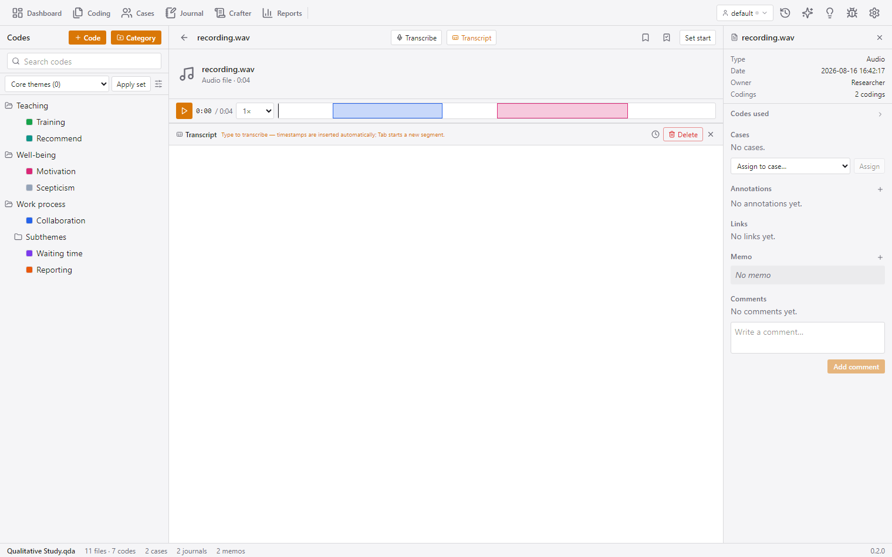

# The Qualitative Coders Guide

[← Back to Documentation Hub](README.md)

QCnext features six specialized coding environments tailored to different media types: Plain Text, PDF documents, Images, CSV/Spreadsheet tables, Webpages, and Audio/Video media. This guide provides a complete reference for all six coders.

---

## Table of Contents
- [Core Coding Concepts & Selection Toolbar](#core-coding-concepts--selection-toolbar)
- [Text Coder](#text-coder)
- [PDF Coder](#pdf-coder)
- [Image Coder](#image-coder)
- [CSV / Table Coder](#csv--table-coder)
- [Webpage Coder](#webpage-coder)
- [Audio / Video Coder & Transcripts](#audio--video-coder--transcripts)
- [Code Tree Management & Autocode](#code-tree-management--autocode)

---

## Core Coding Concepts & Selection Toolbar

Across all text-based coders (Text, PDF, CSV, Webpage, AV Transcripts), selecting content triggers the floating **Selection Toolbar**:

```
 ┌─────────────────────────────────────────────────────────────────────────────┐
 │ [🏷️ Code] [✨ In-vivo] [🔍 Pick Code] [💬 Annotate] [🔗 Link] [📥 Send QTT]  │
 └─────────────────────────────────────────────────────────────────────────────┘
```

### Toolbar Actions
- **🏷️ Code**: Immediately codes the selection with the currently **active code** (selected in the left sidebar code tree). If no code is active, opens the Code Picker.
- **✨ In-vivo**: Creates a brand-new code using the selected text string as its name and codes the passage immediately.
- **🔍 Pick Code**: Opens a searchable code selection popup to choose or create codes on the fly.
- **💬 Annotate**: Opens a popover to attach a text note directly to the passage without assigning a code.
- **🔗 Copy / Paste Segment Link**: Creates MAXQDA-style cross-document quote links (`qcnext-link://`). Clicking a linked segment jumps directly to the target passage, switching files automatically if necessary.
- **📥 Send to QTT**: Sends the selected quote directly to a Crafter worksheet as an analytical segment item.

### Highlighting & Overlaps
- Coded passages are highlighted in the color assigned to the code.
- When multiple codes overlap on the same text, their colors stack cleanly.
- Hovering over a coded segment displays a tooltip with code names and memos; clicking opens the **Segment Details Inspector**.

---

## Text Coder

The **Text Coder** is the primary workspace for interview transcripts, field notes, survey text, and imported documents (`.txt`, `.md`, `.docx`).



### Features & Live Editing

- **Document Reading & Highlights**: Rendered text displays code highlights, annotation underlines (dashed), and outgoing segment links (wavy underline).
- **Live Document Editing**: Toggle **Edit mode** to correct transcription typos directly inside the coder:
  - Text shifts are automatically tracked and debounced.
  - Upon saving (`Ctrl/Cmd+S`), all character offsets for existing codings and annotations are re-anchored instantly.
- **Code Tree Integration**: Single-clicking a code in the left bar sets it as active; double-clicking opens its Inspector details.

---

## PDF Coder

The **PDF Coder** combines visual page region drawing with extracted plain-text coding in a dual-pane environment.



### Features & Dual View

- **Rendered Canvas View**: PDF pages render using PDF.js with continuous scrolling or single-page view.
- **Region Dragging**: Click and drag rectangular regions anywhere on a PDF page to code charts, diagrams, formulas, or non-extractable text. Coordinates are stored in vector page relative space.
- **Extracted Text Mode**: Split view displays extracted plain text alongside rendered pages. Text highlighted on either pane stays completely in sync.
- **Confidence-Ranked Anchoring**: When text is selected on a rendered PDF page, QCnext runs a confidence-ranked matching chain (Exact → Normalized → Word Sequence → Fuzzy) to bind the selection to character offsets in the extracted backend text.

---

## Image Coder

The **Image Coder** allows researchers to mark and code rectangular regions on graphic material (`.png`, `.jpg`, `.webp`, `.svg`).



### Features

- **Crosshair Region Drawing**: Click and drag over photos, diagrams, or scans to mark rectangular regions.
- **Natural Pixel Coordinates**: Region coordinates are saved relative to the image's natural dimensions (`x1, y1, width, height`), preserving exact alignment regardless of zoom level.
- **Zoom & Pan Controls**: Smooth zoom from 10% to 300%, fit-to-width, and drag panning.
- **Region Inspector**: Click any colored image overlay to edit bounding box numbers manually, edit region memos, or delete the region.

---

## CSV / Table Coder

The **CSV / Table Coder** provides cell-level text coding for survey data, tabular datasets, and social media exports.



### Features

- **Cell-Level Character Coding**: Code specific words or phrases *inside* individual cells rather than marking entire table rows.
- **Sticky Table Headers**: Sticky column headers allow smooth vertical and horizontal scrolling through large datasets.
- **Cell Badge Indicators**: Cells containing codings display colored badge clusters indicating applied codes.
- **Plain Text Fallback**: Toggle to view the raw tabular document in the standard text coder if preferred.

---

## Webpage Coder

The **Webpage Coder** handles HTML page captures and web articles imported via URL.

### Features

- **Split View Layout**: Displays the raw rendered HTML snapshot alongside clean extracted article text.
- **Sandboxed Iframe**: Webpage snapshots render inside a sandboxed, script-stripped iframe for complete security while applying live code `<mark>` highlights.
- **Direct Web Selection**: Select text on the rendered webpage to code it directly; selections resolve back to exact source text offsets.

---

## Audio / Video Coder & Transcripts

The **Audio / Video Coder** integrates media playback, timeline range coding, transcript synchronization, Whisper automated transcription, and speaker detection.



### Playback & Timeline Coding

- **Transport Row**: Play/pause, playback speed selector (0.5× to 2.0×), jump ±10s, and clickable waveform timeline.
- **Keyboard & Media Keys**: `Space` toggles play/pause, `F9` inserts timestamps, and hardware media keys control playback.
- **Timeline Range Coding**:
  1. Click **Set start** at the desired playback timestamp.
  2. Play or seek to the end timestamp.
  3. Click **Set end and code** to code the millisecond interval (`pos0` to `pos1`).
  4. Coded ranges appear as interactive colored blocks on the media timeline.

### Automated Transcription (Whisper)

- Click **Transcribe** to launch background transcription powered by Whisper models.
- **Options**: Model size, language selection, translation to English, Voice Activity Detection (VAD), and automatic turn coding.
- **Live Preview**: Progress streams live into the transcript pane as `[mm:ss] text` while transcription runs in the background queue.

### Manual Transcription & Speaker Detection

- **Manual Mode**: Turn on **Transcribe mode** to type transcripts manually. Pressing `Enter` or `F9` auto-inserts timestamp markers `[mm:ss]`.
- **Speaker Detection**: Automatically detect speaker turns from transcript identifiers (e.g., `Speaker 1:`, `[Alice]`, `{@Bob}`) or custom regex patterns. QCnext automatically generates speaker codes and codes every turn across the transcript.

---

## Code Tree Management & Autocode

### Codebook Tree Operations
The left sidebar code tree manages codes and categories:
- **Hierarchical Structuring**: Drag-and-drop codes into categories or sub-codes.
- **Color Swatches**: Assign custom palette colors to codes. Clicking a code swatch toggles visibility of its highlights in the active coder.
- **Code Operations**: Right-click any code to rename, edit memo, merge into another code, or delete.

### Automated Coding (Autocode)
Click **Autocode** in any coder to open the autocode dialog:
1. **Natural Language / AI Autocode**: Instruct the AI assistant (e.g., `"Code passages discussing financial hardship under 'Economic Strain'"`).
2. **Dictionary Autocode**: Apply MAXDictio-style word list dictionaries to automatically code target terms across documents.

---

## Technical Anchoring Summary

| Coder | Coordinate Space / Anchoring Method |
| :--- | :--- |
| **Text Coder** | UTF-8 character offsets (`pos0` – `pos1`). |
| **PDF Coder** | Vector page bounding boxes (`page, x1, y1, w, h`) + confidence-ranked text offset matching. |
| **Image Coder** | Image natural pixel coordinates (`x1, y1, w, h`). |
| **CSV Coder** | RFC-4180 cell offset mappings to raw file character positions. |
| **Webpage Coder** | Collapsed text layer character offsets over DOM nodes. |
| **Audio/Video Coder** | Milliseconds (`pos0` – `pos1` in ms) for timeline ranges; character offsets for transcript text. |

---

[← Back to Documentation Hub](README.md)
