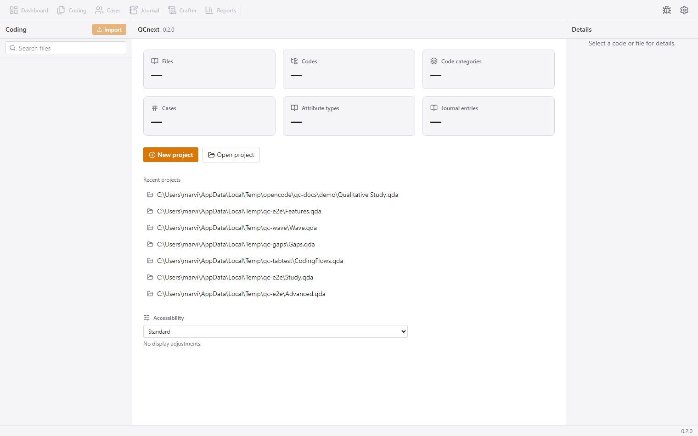

# Dashboard — the start screen

The Dashboard is the app's home. With a project open it shows the project's
statistics; without one it is the **welcome screen** where you create or open a
project and see your recent projects. The app always starts on the Dashboard.

## How to reach it

- Ribbon → **Dashboard** (the first button), or simply start the app.
- The Dashboard is also the empty state shown automatically when no project is
  open.

## What you see

### Without a project

- The heading shows **QCnext** and the app version.
- **Stat cards** (Files, Codes, Code categories, Cases, Attribute types,
  Journal entries) read "—".
- **New project** (primary button) — opens the project form dialog.
- **Open project** (secondary button) — in the desktop app this is the native
  folder picker; picking a folder opens the project immediately (no second
  click). In a plain browser a dialog with a path field is used instead.
- **Recent projects** — the list of previously opened project folders; one
  click re-opens.
- **Accessibility controls** — the display-mode dropdown (off / screenreader /
  high-contrast / large-text / reduced-motion / colorblind-friendly) with a
  short explanation.
- The ribbon's nav buttons are visible but **disabled** until a project loads.
- While the packaged app boots its embedded backend and auto-opens the last
  project, a spinner with the stage ("starting backend" / "opening recent")
  appears next to the Open button.

### With a project open

- The header shows the **project name** and meta: "Database version X · created Y".
- **Stat cards** show real counts: Files, Codes, Code categories, Cases,
  Attribute types, Journal entries.
- New/Open project and the recent list remain available (opening another
  project swaps the current one).

## Workflow

1. **Create a new project**: click *New project*, enter a folder path (the
   desktop app pre-fills `<picked-folder>\NewProject.qda`). Creating a project
   opens it immediately.
2. **Open an existing project**: either click a recent project or use *Open
   project* to browse. Opening is how you resume work; the app remembers your
   recent projects.
3. If a project is **locked** by another live instance, the error banner
   reports who is holding it.

## High-level logic

A project is a **folder** (`.qda`) containing your files plus a SQLite
database. "Opening" a project points the backend at that folder; "creating"
one initialises the database schema inside it. Recent projects are stored in
the app's per-machine settings, so they survive restarts. The desktop app can
be configured to **auto-open** the most recent project at startup (see
[settings.md](settings.md)).
