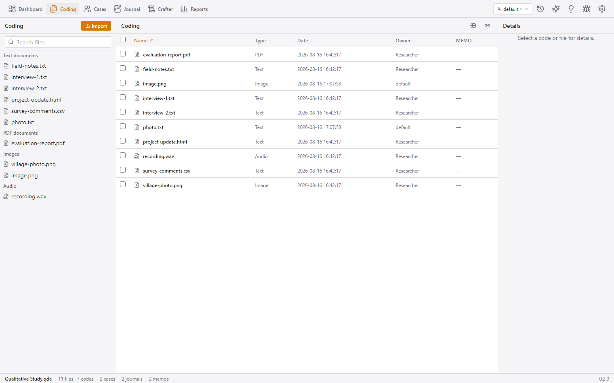

# File Manager — import, organise, and manage your material

The file manager (ribbon → **Coding**) is where your source material lives.
You browse, search, import, batch-process and delete files here. Opening a file
takes you to the matching **coder** (text, PDF, image, CSV, webpage, audio/video).

## How to reach it

- Ribbon → **Coding** (the file-manager screen; the ribbon label is "Coding").
- The left sidebar's **Import** button also triggers this screen's file picker.

## The layout on this screen

- **Left bar**: your files grouped by type — **Text documents**, **PDF
  documents**, **Images**, **Audio**, **Video** — with a search box at the
  top. Clicking a file opens it in the matching coder.
- **Center**: the file table.
- **Right bar**: the Inspector (file details when a file is selected).

## Features

### The file table

Each row shows: name, type (Text/PDF/Image/Audio/Video), date, owner and memo.
Columns are sortable. Scrolling is virtualized, so even projects with thousands
of files stay smooth. The sidebar search box filters both the groups and the
table.

- **Click a row** → opens the file in its coder.
- **Checkboxes** allow multi-select; with a selection the header shows:
  - **Batch transcribe** — disabled unless audio/video files are selected
    (shows "eligible/total"); opens the transcription dialog in batch mode.
  - **Batch autocode** — disabled unless text sources are selected; queues one
    background autocode job per selected file.
  - **Delete selected** (danger, with confirm).
- **Right-click a row** → context menu:
  - **Details** — opens the Inspector for the file.
  - **Add annotation** — opens the Inspector's new-annotation editor.
  - **Rename** — inline editor (Tab moves to the next row).
  - **Edit memo** — opens the Inspector's memo editor in edit mode.
  - **Assign to case…** — prompt for a case name; links the file to that case.
  - **Replace file** (text sources only) — pick a new document; QCnext
    re-anchors codings, annotations and case links by first-match text.
  - **Delete** — confirm dialog; deletes the file, its codings, annotations
    and links (audio/video files also delete their transcript companion).

### Importing files

- The **Import** button (hidden file picker, multi-file). Files are imported
  sequentially with a progress bar in the ribbon's task flyout. Files with a
  name that already exists are **skipped** and reported in a warning banner.
- **Drag & drop** files onto the file area — a dashed "Drop to import" overlay
  appears.
- **Import from URL** (globe icon) — opens the URL import dialog
  ([see below](#url-import)).

### URL import

Imports a web resource as a new source (the backend does the fetching and
parsing):

- **Mode**: Article (the page's article text — default), HTML (raw snapshot),
  PDF (a PDF rendering of the page), or YouTube (the video's comments as a CSV;
  can legitimately take minutes — a hint explains this).
- The mode is **auto-selected** from the URL for unambiguous hosts
  (any `youtube.com` / `youtu.be` URL → YouTube); a manual choice is
  remembered across dialog opens.
- YouTube imports land as a `.csv` source that opens in the **table coder**.
- Captured webpages open in the **webpage coder**.

### Saved filters

The header has a dropdown of **named search filters**: save the current query
as a filter, re-apply it, or delete an applied filter — handy for repeatedly
finding "all audio files" or "everything by coder X".

### Broken-links repair

If you moved or renamed a linked file on disk (media referenced by path rather
than copied in), the **broken-links** tool (link icon) lists every source whose
media file is missing (name + stored path). Per row:

- **Fix** — prompts for the new location (the filename must match).
- **Bulk rename path** — replace a path prefix across all sources at once and
  see how many were updated.

### Empty states

No files → a prominent Import button. No search match → a hint.

## High-level logic

- Files can be **copied into the project folder** (the normal "Import" path,
  making the project portable) or **linked by path** (the file stays where it
  is — used for the broken-links workflow).
- Import and the batch jobs run through the **background task queue**, so
  large imports never block the interface (see
  [status-and-tasks.md](status-and-tasks.md)).
- Replacing a file is not a byte-level swap: the backend re-anchors every
  coding/annotation by matching the old text against the new document, so your
  analytical work survives the replacement.
