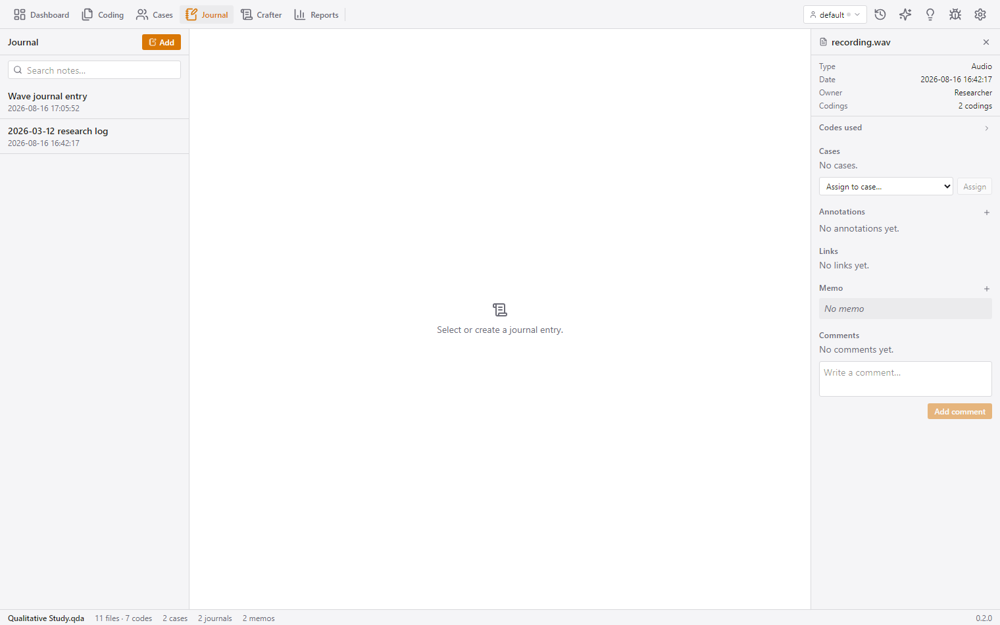
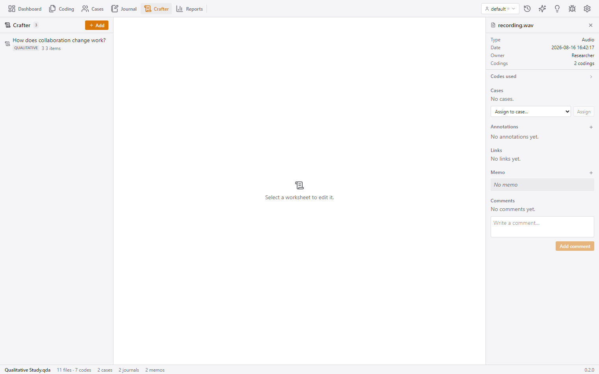

# Notes, Worksheets & Synthesis Guide

[← Back to Documentation Hub](README.md)

This guide covers analytical writing, reflective journaling, structured worksheets in **Crafter (QTT)**, and the **Creative Coding** scratchpad for turning coded data into compelling research arguments.

---

## Table of Contents
- [Overview of Analytical Synthesis](#overview-of-analytical-synthesis)
- [Notes: Journal, Annotations & Memos](#notes-journal-annotations--memos)
- [Crafter: Questions-Themes-Theories (QTT) Worksheets](#crafter-questions-themes-theories-qtt-worksheets)
- [Creative Coding Scratchpad](#creative-coding-scratchpad)

---

## Overview of Analytical Synthesis

Qualitative research extends far beyond attaching labels to text. QCnext provides three complementary layers for analytical writing and synthesis:

1. **Reflective Notes**: Methodological journaling, passage annotations, and code/file memos.
2. **Creative Coding**: An incubator for capturing early ideas and converting fragments directly into codes.
3. **Crafter (QTT Worksheets)**: Structured workspaces for gathering quotes, charts, notes, and links under research questions to build final analytical arguments.

---

## Notes: Journal, Annotations & Memos

Access the Notes workspace by clicking **Journal** in the ribbon.

### 1. Research Journal
- **Methodological Notebook**: A dated research log for capturing field notes, personal reflections, coding rules, and analytical decisions.
- **Features**: Create dated entries, search entry text, rename inline, and export notes. Unsaved drafts persist automatically across view refreshes.

### 2. Passage Annotations
- **Targeted Passage Notes**: Annotations are notes attached directly to specific character ranges in documents (distinct from codes).
- **Features**: Passage annotations appear with dashed underlines in coders. The Annotations manager lists all project annotations with quick jump-to-file links.

### 3. Memos (Code & File Memos)
- **Analytical Commentary**: Memos articulate the meaning, boundaries, and evolution of codes or files.
- **Tree View**: Code memos are displayed in a collapsible tree mirroring the codebook structure.
- **Single Source of Truth**: Editing a code memo from the Inspector, Code Tree, or Notes view updates the exact same underlying memo instantly.

---

## Crafter: Questions-Themes-Theories (QTT) Worksheets

**Crafter** is an advanced analysis workspace based on the **QTT (Questions-Themes-Theories)** framework popularized by MAXQDA. Worksheets organize findings into thematic sections guided by a research question.

### Creating Worksheets & Templates

Click **Add Worksheet** and select a template type:
- **Qualitative Template**: Flexible single-column layout seeded with default "Insights" sections.
- **Mixed-Methods Template**: Two-column layout seeded with **Creswell's 14 Mixed-Methods Steps** (Research Questions, Data Collection & Analysis, Joint Display Planning, Data Integration, Meta-Inferences, Validity, Ethical Considerations, Implications).

### Worksheet Items & Dynamic Links

Worksheet sections hold four types of curated items:

| Item Kind | Content & Behavior |
| :--- | :--- |
| **Quote Segment** | Direct quote extracted from a document. **Clicking a segment item jumps directly to the source passage in the active coder.** |
| **Analytical Note** | Free-text commentary written directly within the section. |
| **Chart Reference** | Linked snapshot of an analytical report or visual code graph. |
| **External Link** | Web URL reference opening in your browser. |

### Sending Quotes to QTT from Coders
While reading a document in any coder, select a passage and click **Send to QTT** in the floating toolbar. Choose a worksheet and section; the quote is saved as a live-linked segment item.

---

## Creative Coding Scratchpad

The **Creative Coding** scratchpad opens in the right-bar utility pane (click 💡 **Creative** in the ribbon). It provides an "incubator" for preliminary thoughts that are not yet formal codes.

### Workflow

1. **Capture Ideas**: Type free-form thoughts, quotes, or observations as you read.
2. **Attach Sources**: Items created from document selections retain a **source chip** link back to the document text.
3. **Inline Refinement**: Edit notes and organize scratchpad items.
4. **Promote to Code**: Click the lightbulb icon on any item to open the **Promote to Code** dialog:
   - Converts the scratchpad entry into a durable code in your codebook.
   - If the item had an attached source quote, automatically **codes the referenced document passage** with the newly created code.

---

[← Back to Documentation Hub](README.md)
