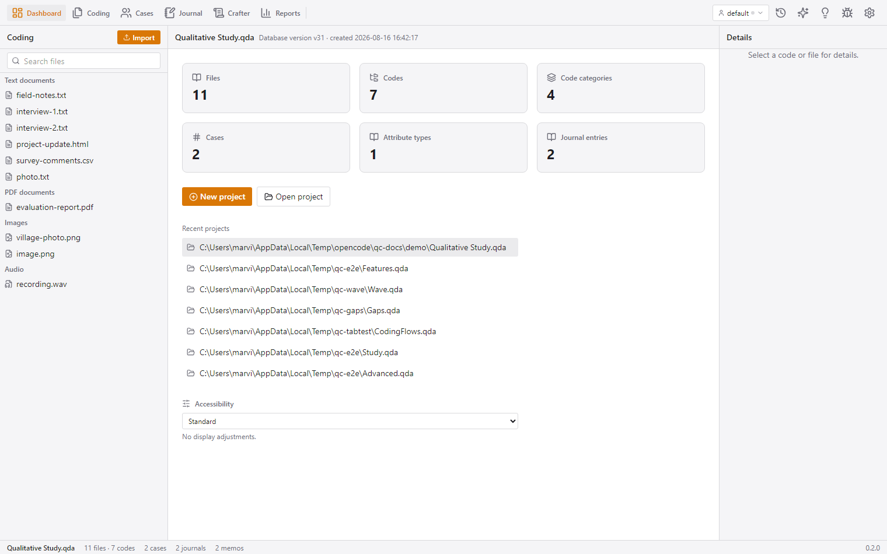

# The Shell — workspace layout, ribbon, coder switcher, task queue, Inspector

The shell is the skeleton around every screen: the five-slot workspace layout
(ribbon / optional menu bar / left bar / center / right bar / status bar), the
global chrome that stays visible no matter where you are, and the pieces that
don't belong to any single screen:

- the **ribbon** (navigation + toolbars),
- the **coder switcher** flyout (who is working, collaboration sync),
- the **background-task queue** flyout,
- the **Inspector** (the right-bar details panel),
- the **status bar**.

This page covers those global pieces. Each screen's own features are covered in
its own page.

---

## The layout

```
┌──────────────────────────────────────────────────────────────────┐
│ RIBBON — Dashboard · Coding · Cases · Journal · Crafter · Reports│
│         ─── divider ─── [task chip] [coder switcher] [⌛ AI ✨ ⚙ 🐞]│
├──────────────┬─────────────────────────────────┬─────────────────┤
│ LEFT BAR     │ CENTER VIEW                     │ RIGHT BAR       │
│ w-64/w-72    │ flex-1                          │ w-72            │
│ (per-screen  │ (the active screen)             │ (Inspector or a │
│  list)       │                                 │  toggleable pane)│
├──────────────┴─────────────────────────────────┴─────────────────┤
│ STATUS BAR — project name · N files · M codes · … · version       │
└───────────────────────────────────────────────────────────────────┘
```

- With a project open the full workspace renders; without one, only the ribbon
  (navigation disabled) and the dashboard empty state show.
- The left and right bars are **resizable**: drag the inner border (clamped
  200–520 px). Dragging a bar past ~140 px hides it entirely; a small arrow
  tab on the edge recalls it.
- The center view is the only flexible region; everything else is fixed.

## Ribbon

The ribbon is the app's single row of navigation:

- **Nav buttons** (icon + label, active = accent): **Dashboard**, **Coding**
  (the file manager), **Cases**, **Journal** (notes), **Crafter** (QTT),
  **Reports** (analysis). Without a project these are disabled.
- A thin **divider**, then the **task-queue chip** (a circular progress ring —
  appears whenever background jobs exist), the **coder switcher**, and the
  right-side icon buttons:
  - **History** (clock) — opens the audit-log pane.
  - **AI** (sparkles) — opens the AI chat/search pane.
  - **Creative** (lightbulb) — opens the creative coding scratchpad.
  - **Report a bug** (bug) — the GitHub issue composer (see
    [bug-report.md](bug-report.md)).
  - **Settings** (gear) — available even without a project (theme, AI and
    transcription options are machine-level, not project-level).
- The right-side buttons **toggle right-bar panes**: clicking an active button
  closes the pane; opening a file in the coder returns the right bar to the
  Inspector automatically.

## Coder switcher

The ribbon button showing the current **coder name** (person icon + name + a
small status dot + chevron) opens a flyout for managing coders and
collaboration:

- **Coder list**: every coder in the project with their coding count; the
  current coder is highlighted. Click another coder to **switch** who you are
  working as. Each row has:
  - an **eye/eye-off** button — hide/show that coder's codings and annotations
    in all views and reports (per-coder visibility, useful for blind
    interrater checks),
  - a **trash** button — delete the coder. If the coder still owns codings,
    QCnext asks for a coder to **reassign** their work to. (The current coder
    cannot be deleted.)
- **Add new coder** — an inline name field; creating a coder also switches to
  them.
- **Right-click a coder row** → a context menu with Rename and Statistics (a
  modal listing that coder's entry counts per table: sources, codings,
  annotations, cases, …).
- **Refresh project data** — reloads everything from disk (useful when files
  changed outside QCnext or another instance saved).
- **Enable collaboration (sync)** — the switch that turns the background sync
  cycle on/off (see [status-and-tasks.md](status-and-tasks.md)). While on:
  - a yellow **Sync now** button runs an immediate sync,
  - status lines show **pending changes** (export + import), each
    **collaborator's last-sync time** and pending-import count, and the last
    **error** in red.

The **status dot** on the ribbon button mirrors sync health: green = syncing
healthily, red = error, grey = sync off (hover for "last sync Nm" or the error).

## Task-queue flyout

The circular chip in the ribbon opens the **Tasks** flyout listing all
background jobs (see [status-and-tasks.md](status-and-tasks.md) for details):
transcription and autocode jobs with progress bars, pause/resume, drag-to-reorder,
clear-finished, the file-import progress row, and the app-update status row.

## Inspector (the default right bar)

The right bar normally shows the **Inspector** — details of the currently
selected code or file. Header: the item's icon + name (or "Details") + a close
button. Empty state: *"Select a code or file for details."*

### Code details

- **Category path** breadcrumb (e.g. `Theme › Subtheme`), or "—" for a
  top-level code.
- **Stats**: coding count, files count.
- **Memo editor**: the code's memo (or "No memo"); clicking it switches to an
  inline textarea with Save/Cancel. Any "Edit memo" action elsewhere opens the
  Inspector's memo editor directly. Right-clicking the memo label jumps to the
  **Memos** tab in Notes.
- **Recent segments**: up to five recent coded segments (file name + excerpt);
  clicking one opens that file in the coder and jumps + flashes to the segment.
- **Comments**: a threaded discussion on the code (add / delete).
- **Delete code** (danger, confirm dialog).
- **Highlight in open file** toggle: dims every other code's segments in the
  open coder, so you can see exactly where this code appears.

### File details

- **Meta**: type (Text/PDF/Image/Audio/Video), date, owner, total coding count.
- **Codes used** (collapsible): chips of codes with counts; clicking a chip
  toggles hiding/showing that code's segments in the open coder.
- **Cases**: the file's assigned cases with an unassign button, plus a dropdown
  to assign more.
- **Annotations on this file**: list of annotations with inline memo editing
  and delete; the + button adds a new annotation right there.
- **Links**: outgoing segment links (click to jump to the target passage) and
  incoming links (who points at this file, with delete).
- **Memo editor**, **Comments** (same as codes), and **Open in coder**.

## Status bar

A thin strip at the very bottom: **project name** (bold) · "N files · M codes"
· cases / journals / annotations / memos counts (shown only when non-zero) ·
spacer · **app version**.

## Accessibility & theme

- **Dark/light theme**: persisted per machine (defaults to the OS preference).
- **A11y display modes**: off / screenreader / high-contrast / large-text /
  reduced-motion / colorblind-friendly — persisted, applied as classes on the
  document root. Screen-reader mode also mounts an `aria-live` region for task
  announcements and a visible **skip link**.
- **Right-click context menus** are custom everywhere (the browser menu is
  suppressed); destructive actions always confirm; renames use inline editors
  or prompts.

---

## Screenshots

The Dashboard with a project open shows the full shell (ribbon, left bar,
center, Inspector, status bar):


